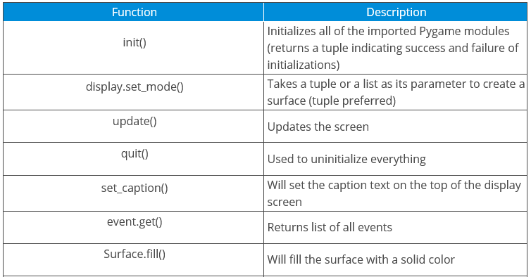

# Snake_Game_Python

Ludo snake game 🐍 with python pygame library 🐙 ⚡ 🐱 = :octocat:

The snake game is a very popular and fun game. Every time the snake eats the foods, its length grows longer that makes the game more difficult.

About Snake Game Python Project 🐍

The objective of project is to build a snake game project. In this project, the snake can move in horizontal and vertical directionIf the snake touches itself or the border of the game then the game will over. tThe background music is added to make more fun and score will be visible as well. ( simple hack - it can also move cross directional with little bit change in the code 😂 ). 

 

Important Points to build the Snake Game in Python 🙌 

  Installing Pygame
  
  Create the Screen
  
  Create the Snake
  
  Moving the Snake
  
  Game Over when Snake hits the boundaries
  
  Adding the Food 🍤
  
  Increasing the Length of the Snake 
  
  Displaying the Score
  
  Adding the Background Music 
  
Pre-requisites:
    Python 
    
Installing pygame 

 pip install pygame

Pygame functions that have been used in this Snake Game along with their descriptions.

  
   

Done:)

In reality, It's not possible but in coding world 👨‍💻,

I have created the snake 🐍 which will increase the length 📏 ✨ by eating foods each and everytime.

Have Fun with some riddles🦖

What do you get when you cross a snake and a pie?

(A pie-thon!) 

Why couldn't the snake talk?

(It had a frog in his throat!)

Why are snakes hard to fool?

(You can't pull their leg!) 

What is a snake's favorite dance?

(The mamba!) 

What do most people do when they see a python?

(They re-coil!)

Have a good day 🙌 !
